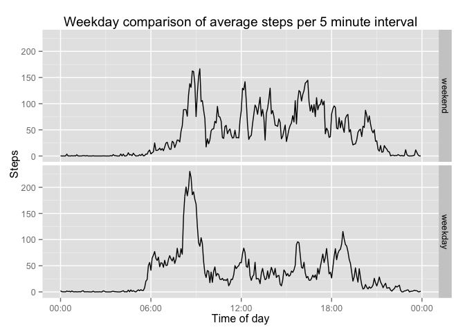

# Reproducible Research - Peer Assesment 1
Chris O'Brien  
13 June 2015  

## Required modules

In order to perform the analysis for this research we will require a few modules.  

For this we will use: 

* data.table - CSV load  
* dplyr - data cleaning and manipulation
* lubridate - date manipulation
* ggplot2  - data plotting
* chron - time manipulation


```r
library(data.table)
library(dplyr)
library(lubridate)
library(ggplot2)
library(chron)
```

## Loading and preprocessing the data

The data for this task has been provided to us in 'activity.zip', in order to perform any processing we will need to unzip the csv file and then read it into a data.table.


```r
load_data <- function() {
    unzip('activity.zip')
    fread('activity.csv')
    }
data <- load_data()
```

Once the data is loaded we will perform some initial processing to the data, this includes: 

1. Creating a date object from the date string in the csv
1. Modifying the time string to pad it out with zeros and add seconds
    * Eg. '5' -> '00:05:00'
1. Create lubridate time object from the time string and merge it with the date
1. Convert the new time_string to a chron time. This will make exploratory analysis easier
1. Add a factor column of whether the date is a weekday or not


```r
process_data <- function(df){
    df %>% 
        mutate(date=ymd(date), 
               time_string=lapply(interval, FUN=process_time), 
               datetime=date + hms(time_string),
               time=chron(times.=time_string),
               weekday=factor(wday(date) %in% 2:6,labels = c("weekend", "weekday")))
    }

process_time <- function(time_value){
    time_string <- as.character(time_value)
    if(nchar(time_string) < 4){
        fill_size <- 4 - nchar(time_string)
        time_fill <- paste(rep("0", fill_size), collapse = "")
        time_string <- paste(time_fill, time_string, sep = "")
    }
    time_string <- paste(substr(time_string, 1, 2), ":", substr(time_string, 3, 4), ":00",
                         sep="")
    time_string
}
data <- process_data(data)
```

## What is mean total number of steps taken per day?

In order to get an idea of how the amount of steps per day varies we will plot a histogram of the total_step count for the days in our data set.

Before we can begin we need to filter out the NA values of steps. Once that is done we group by the date and sum all the steps on each given day.


```r
date_summary<-data %>% 
    filter(!is.na(steps)) %>% 
    group_by(date) %>% 
    summarise(total_steps=sum(steps))
head(date_summary)
```

```
##         date total_steps
## 1 2012-10-02         126
## 2 2012-10-03       11352
## 3 2012-10-04       12116
## 4 2012-10-05       13294
## 5 2012-10-06       15420
## 6 2012-10-07       11015
```

Taking our date summary we plot the frequency of total steps on a day. As this is arguably exploratory analysis we don't have to label all the axis and title perfectly but it's certainly safer to do so!


```r
qplot(total_steps, data=date_summary) + 
    labs(x='Total Steps',y='Frequency') + 
    ggtitle('Frequency of Total Steps per Day')
```

 

Finally get a view into the distribution of the total steps per day, the mean is the red dashed line on the box plot.


```r
summary(date_summary$total_steps)
```

```
##    Min. 1st Qu.  Median    Mean 3rd Qu.    Max. 
##      41    8841   10760   10770   13290   21190
```

```r
ggplot(date_summary, aes(factor(0), total_steps)) +
    geom_boxplot() +
    geom_hline(yintercept=mean(date_summary$total_steps), color='red', lty=2) +
    coord_flip() +
    labs(y="Total Steps", x="") + 
    ggtitle("Total Step Distribution")
```

 

## What is the average daily activity pattern?

To determine the average daily activity pattern we begin by again filtering out the steps where we have NA values. Once that is done we group by the time column and summarise by the mean number of steps over that interval.

Once this is done in order to determine the time which had the max average we filter there the avg steps equals the maximum of the average steps.

Finally this is plotted as a line graph, adjusting the x axis labels to be in the format "HH:MM", finally adding in labels to the graph.

*Note: I have set the system timezone to GMT here to get the plotting correct. ggplot2 decides that it knows better otherwise and assumes that the time needs to be BST*

```r
avg_data <- data %>% 
    filter(!is.na(steps)) %>% 
    group_by(time) %>% 
    summarise(avg_steps=mean(steps))
max_frame <- avg_data %>% filter(which.max(avg_steps))
max_time <- as.character(max_frame[['time']])
max_interval <- data %>% filter(time==max_frame$time) %>% select(interval)
max_interval <- max_interval$interval[1]
max_frame
```

```
## Source: local data table [1 x 2]
## 
##       time avg_steps
## 1 08:35:00  206.1698
```

```r
Sys.setenv(TZ='GMT')
qplot(time, y=avg_steps, data=avg_data, geom='line') + 
    scale_x_chron(format="%H:%M") +
    labs(x='Time of day', y='Steps') +
    ggtitle('Average steps per 5 minutes interval')
```

 

The time with the greatest average steps is **08:35:00** known as interval: **835**

## Imputing missing values

To impute the missing values the best way to do this would be calculating a linear model based on the steps for a given interval. Better than this would be to factor it based off the day of the week. We suspect that an individual behaviour is unlikely to change on any given Monday but would between a Sunday and a Monday (It would require further investigation that is outside the scope of this initial analysis). 

In order to perform our data inference we need to get the rows that we have complete data for. So we filter out for our inital column set and use complete.cases to get the rows we have a full set of data for.

The reason we didn't use 'is.na' on steps is because while we know there wasn't any NA values in date and interval the assignment asked us to find **any** missing values, complete.cases seemed like a better option.


```r
missing_value_count <- sum(complete.cases(select(data,steps:interval)))
missing_value_count
```

```
## [1] 15264
```

So the dataset has a total of *15264* missing values.

To perfom our inference we merge our original dataset with out time averaged dataset from earlier. Then create a new column called imputed steps that is initially our time averaged steps then replaced by the actual values where we have one.


```r
data <- merge(data,avg_data,by='time') %>% arrange(date, time)
data$imputed_steps <- data$avg_steps
data <- data[!is.na(steps),imputed_steps:=as.numeric(steps)]
head(data)
```

```
##       time steps       date interval time_string            datetime
## 1 00:00:00    NA 2012-10-01        0    00:00:00 2012-10-01 00:00:00
## 2 00:05:00    NA 2012-10-01        5    00:05:00 2012-10-01 00:05:00
## 3 00:10:00    NA 2012-10-01       10    00:10:00 2012-10-01 00:10:00
## 4 00:15:00    NA 2012-10-01       15    00:15:00 2012-10-01 00:15:00
## 5 00:20:00    NA 2012-10-01       20    00:20:00 2012-10-01 00:20:00
## 6 00:25:00    NA 2012-10-01       25    00:25:00 2012-10-01 00:25:00
##   weekday avg_steps imputed_steps
## 1 weekday 1.7169811     1.7169811
## 2 weekday 0.3396226     0.3396226
## 3 weekday 0.1320755     0.1320755
## 4 weekday 0.1509434     0.1509434
## 5 weekday 0.0754717     0.0754717
## 6 weekday 2.0943396     2.0943396
```

Similar to before we aggregate by date and get a sum of the total imputed steps for the day.


```r
imputed_date_summary <- data %>% 
                          group_by(date) %>% 
                          summarise(total_steps=sum(imputed_steps))
head(imputed_date_summary)
```

```
##         date total_steps
## 1 2012-10-01    10766.19
## 2 2012-10-02      126.00
## 3 2012-10-03    11352.00
## 4 2012-10-04    12116.00
## 5 2012-10-05    13294.00
## 6 2012-10-06    15420.00
```

```r
summary(imputed_date_summary$total_steps)
```

```
##    Min. 1st Qu.  Median    Mean 3rd Qu.    Max. 
##      41    9819   10770   10770   12810   21190
```

Here we have plotted both histograms against each other (red=Imputed, blue=Actual) and a vertical line representing the median of our total steps in order to better view the differences. We can see from the plot that the frequency of dates with a total steps at the median increases. 


```r
ggplot(imputed_date_summary, aes(x=total_steps)) + 
    geom_histogram(data=imputed_date_summary, fill='red', alpha=0.2, position="identity") + 
    geom_histogram(data=date_summary, fill='blue', alpha=0.2, position="identity") + 
    geom_vline(xintercept=median(date_summary$total_steps), color='red', lty=2) + 
    labs(x='Total Steps',y='Frequency') + 
    ggtitle('Frequency of Total Steps per Day')
```

 

## Are there differences in activity patterns between weekdays and weekends?

This leads into our assumptions before that there are differences between each day of the week or whether it's a weekend or not.

In order to perform this analysis we have to group by our 'weekday' factor and the time pulling the average of our imputed steps column.


```r
weekday_avg <- data %>% 
    group_by(weekday, time) %>% 
    summarise(avg_steps=mean(imputed_steps))
head(weekday_avg)
```

```
##   weekday     time  avg_steps
## 1 weekday 00:00:00 2.25115304
## 2 weekday 00:05:00 0.44528302
## 3 weekday 00:10:00 0.17316562
## 4 weekday 00:15:00 0.19790356
## 5 weekday 00:20:00 0.09895178
## 6 weekday 00:25:00 1.59035639
```

Then plotting the two against each other we see that during the weekday there is arguably more steps on average in the morning which drops off towards midday. Weekends on the otherhand sees more steps later into the evening.


```r
qplot(time, y=avg_steps, geom='line', facets=weekday~., data=weekday_avg) + 
    scale_x_chron(format="%H:%M") +
    labs(x='Time of day', y='Steps') + 
    ggtitle('Weekday comparison of average steps per 5 minute interval')
```

 
